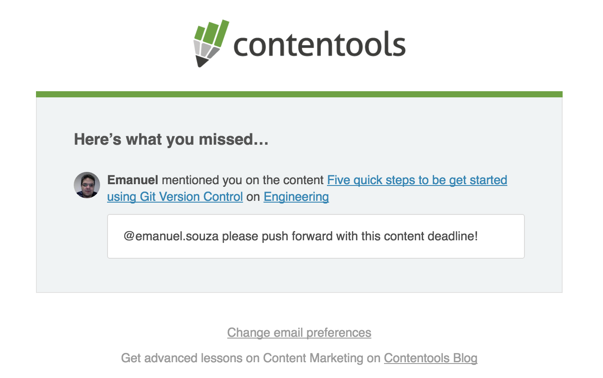
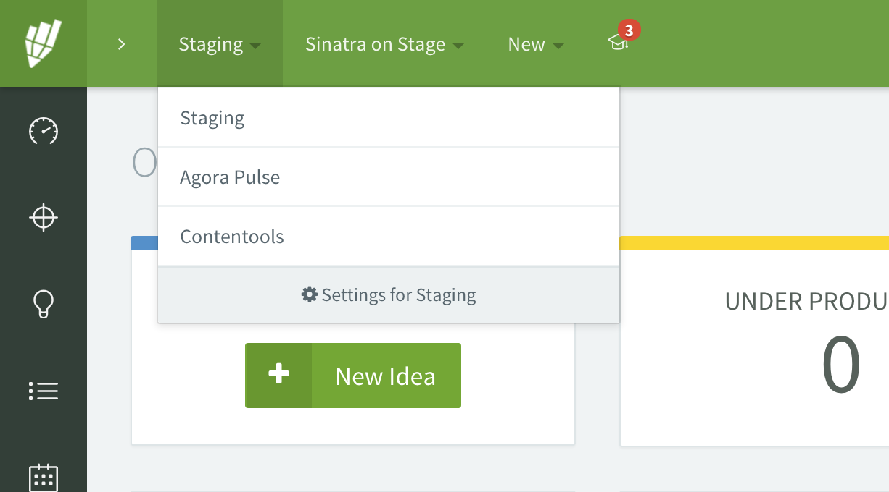

# Release Log - v3.0.2

## Mentions
Agora os usuários da plataforma podem mencionar membros do time de conteúdo dentro dos
comentários! Experimentem digitando '@' e selecionando um membro da lista.

Ao confirmar o comentário, a pessoa mencionada receberá uma notificação interna da plataforma
e um e-mail como este:

## Unsubscribe do Resumo Diário
Os emails de resumo diário agora possuem um link chamado **Change email preferences** no
final do corpo do email.  
  

## Migrações em Paralelo
Os releases da plataforma que acontecem todas as terças feiras a meia noite passaram a ser
mais rápidos. Quando alteramos coisas importantes na base de dados dos clientes, normalmente
isso tomava várias horas no processo de release. Conseguimos reduzir o tempo para aproximadamente
1 hora de release depois desta melhoria. Isso diminuiu drásticamente nosso downtime de manutenção
semanal, garantindo uma maior qualidade de serviço para os nossos clientes.

## Layout Improvements
Fizemos alguns ajustes no layout do menu superior da plataforma. Alguns redatores (principalmente
profissionais do marketplace) estavam reclamando que não conseguiam enxergar a lista de companies
devida a falta de *scroll-bar* no drop-down de companies. Solucionamos isso adotando o mesmo layout
do wizard.  

# Invite Message
Agora a plataforma permite que você convide pessoas personalizando a mensagem do email.

## Bug Fixes
- Bug relacionado a content-types que não aparecem todos as fases do workflow.
- Company sem projetos estava mostrando texto em inglês mesmo quando cliente usava locale pt-BR.
- Removido o código da Intro.JS do sistema para não aparecer mais aquela introdução feia na plataforma.
- Encontramos um bug na biblioteca de integração do zapier. Mandamos o fix para eles, e gentilmente aceitaram e colocaram no código base deles.

  

\- made with :heart: by Contentools Product Team
