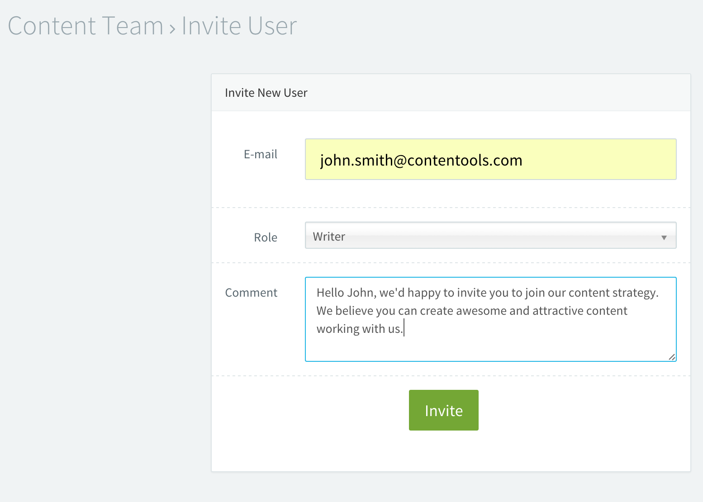

# Release Log - v3.0.2
Hello everyone, this is the third release we have on this quarter with a lot of really
great improvements. We worked hard this week to deliver a better experience to our customers
and partners. Here is a list of new features, improvements and bug fixes we made.

## Mentions
The ability to notify someone when a content needs attention is important. Our team
designed a way to mention project team members on a content by typing '**@**' inside the
comments tab. Check this out:

The new comment will issue an in-app notification to the given user and send it by
email. This email notification can be disabled on User > Settings > Notifications menu.

## Unsubscribe from Daily Digest
Sometimes its hard to remember which workspaces we are involved with. Usually marketplace content
professionals interacts with a lot of workspaces and are annoyed by tons of digest emails.
The ability to change the notification preferences directly by clicking on the link provided
in the end of email body is primordial.
  

## Parallel Releases
The contentools platform releases happens every tuesday near 10 PM PST. Aiming the reduce the
web interface downtime our team developed a release process that updates all customers
workspace databases in parallel. Our releases are 400% faster now. Our last release took only
one hour to update all our customers databases. It assure our partners the reliability of
contentools platform to a new level.

## Layout Improvements
Our UX Jedi Knights made some adjustments on the header toolbar. Some users were experiencing
difficult in listing all workspaces they are involved in. We added a new layout supporting
overflow scroll-bars, very similar to the solution we have on the wizard menu.

# Invite Message
A good internal communication is the key to the team interaction success. Targeting this, we
added the ability to customise the invitation email text. Check it out:

## Bug Fixes
- Sometimes, after creating a new content type, the workflow phases desappear (fixed).
- The warning message about workspaces without projects wasn't localized to pt-BR locale.
- Removed the buggy platform automated onboarding script. A new onboarding experience is being created (soon).
- Our team found a problem on zapier rest hook public library that was causing abnormal behavior on
our initial integration tests. The engineering team made a bug fix and send back to zapier team analyze
and they accepted the solution. The whole python community benefited from it.

  

\- made with :heart: by Contentools Product Team
