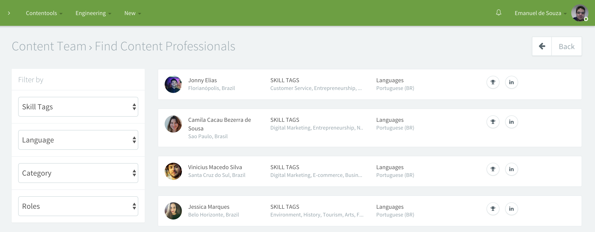
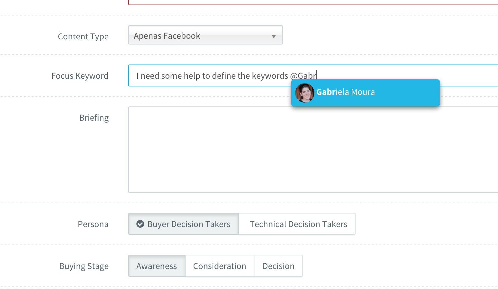

# Release Notes - v3.0.3

Hello content geeks, this our first release in June 2016 and probably the second-last of the quarter. Our efforts were focused on improving some features on Contentools and other quick fixes. This week we had very few bug reports, motivating our team planning some new features that are comming (later on this article).

## Improvements
We developed some quick improvements to offer a better experience inside Contentools platform. You can check the following list:

### Added project integrations info
Assuring users can identify how many media integrations are being used in each project, we added the information to the top label of the integration bar.

### Show invited content professionals as disabled
Previously invited professionals are now displayed as disabled on the **find content professionals list** to avoid confusion.

### Mentions everywhere!
We added the ability to mention users in any place you can write text or detail an explanation, like on the project strategy, ideas etc.
Take your time and check it out!

## Bug Fixes
Here is a list of the few bugs we detected from our last release:

* Missed translations in some terms inside content professional profiles for Brazilian Portuguese language.
* Some users were not receiving emails from Slave Roboto (our mail transaction agent nickname) due to a problem with SPF and DKIM.
* We had problems with SSL ceriticate on our website. No side effects to the platform security layer because we use different certificates.
* The 'start production' button is now only active for users who have permission to use it.

## What is comming?
We are proud to annouce we are almost finishing our brand new blog post editor with a lot of user experience improvements. Also, we have some big deliverables in the next weeks to improve the platform communication with wordpress, enabling users to edit the content inside the blog CMS and synchronize gain with Contentools platform. The ability to create blog posts with images in the content body is under development. We are very excited about these deliverables. Feel free to give us feedbacks!

with :heart:, Contentools Product Team.
